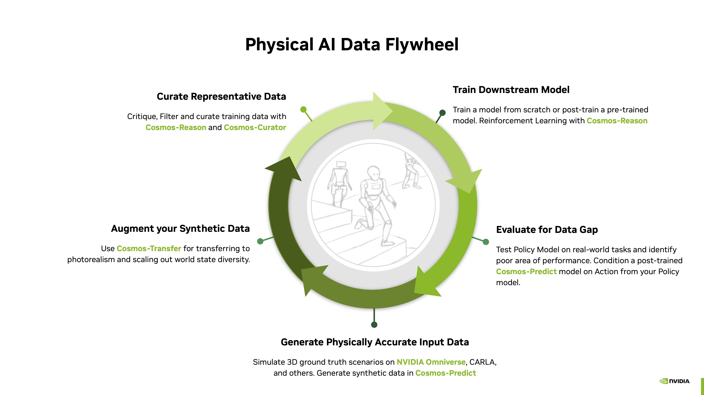

# NVIDIA Cosmos

[NVIDIA Cosmos™](https://www.nvidia.com/en-us/ai/cosmos/) is a platform purpose-built for physical AI, featuring state-of-the-art generative world foundation models (WFMs), robust guardrails, and an accelerated data processing and curation pipeline. Designed specifically for real-world systems, Cosmos enables developers to rapidly advance physical AI applications such as autonomous vehicles (AVs), robots, and video analytics AI agents.

# Cosmos 3
[Cosmos 3](https://www.nvidia.com/en-us/ai/cosmos/) is live! We’re excited to share that Cosmos 3 has launched — NVIDIA’s next-generation family of open omnimodal world foundation models for Physical AI. As part of this launch, the Cosmos GitHub repositories have moved to [the main NVIDIA GitHub organization](https://github.com/nvidia/cosmos):

👉 https://github.com/nvidia/cosmos

[Cosmos 3](https://www.nvidia.com/en-us/ai/cosmos/) unifies language, images, video, audio, and actions in a single architecture, enabling developers to build agents that can understand, reason, simulate, and act in the physical world. Please use [the new repository](https://www.nvidia.com/en-us/ai/cosmos/) as the source of truth for the latest code, models, documentation, and updates.

# Cosmos 2 Models

Cosmos World Foundation Models come in three model types which can all be customized in post-training: [cosmos-predict](https://github.com/nvidia-cosmos/cosmos-predict2.5), [cosmos-transfer](https://github.com/nvidia-cosmos/cosmos-transfer2.5), and [cosmos-reason](https://github.com/nvidia-cosmos/cosmos-reason2):

<table align="center">
  <tr>
    <th></th>
    <th>
<a href="https://github.com/nvidia-cosmos/cosmos-predict2.5">Predict</a>
</th>
    <th>
<a href="https://github.com/nvidia-cosmos/cosmos-transfer2.5">Transfer</a>
</th>
    <th>
<a href="https://github.com/nvidia-cosmos/cosmos-reason2">Reason</a>
</th>
  </tr>
  <tr>
    <td align="center"><b>Type</b></td>
    <td align="center">World Generation</td>
    <td align="center">Multi-Controlnet</td>
    <td align="center">Reasoning VLM</td>
  </tr>
  <tr>
    <td align="center"><b>Function</b></td>
    <td align="center">Predict novel future frames given initial frames</td>
    <td align="center">Transfer existing control frames into photoreal frames within a video clip</td>
    <td align="center">Reason against frames within a video clip</td>
  </tr>
  <tr>
    <td align="center"><b>Use Cases</b></td>
    <td align="center">Data Generation &amp; Policy Evaluation</td>
    <td align="center">Data Augmentation</td>
    <td align="center">Data Curation, Robot Planning and Policy &amp; Vision AI Agents</td>
  </tr>
  <tr>
    <td align="center"><b>Inputs</b></td>
    <td align="center">Text, Image, Video</td>
    <td align="center">Multiple Video Modalities such as RGB, Depth, Segmentation, and more.</td>
    <td align="center">Video, Image &amp; Text</td>
  </tr>
  <tr>
    <td align="center"><b>Outputs</b></td>
    <td align="center">Video</td>
    <td align="center">Video</td>
    <td align="center">Text</td>
  </tr>
</table>

# NVIDIA Cosmos Cookbook
The [Cosmos Cookbook](https://github.com/nvidia-cosmos/cosmos-cookbook) offers developers step-by-step recipes and post-training scripts to quickly build, customize, and deploy NVIDIA’s Cosmos world foundation models for robotics and autonomous systems.

# Use Cases in Physical AI Development

Our world foundation models are purpose-built to accelerate improving performance in downstream model tasks in various stages, as illustrated here in the flywheel.

