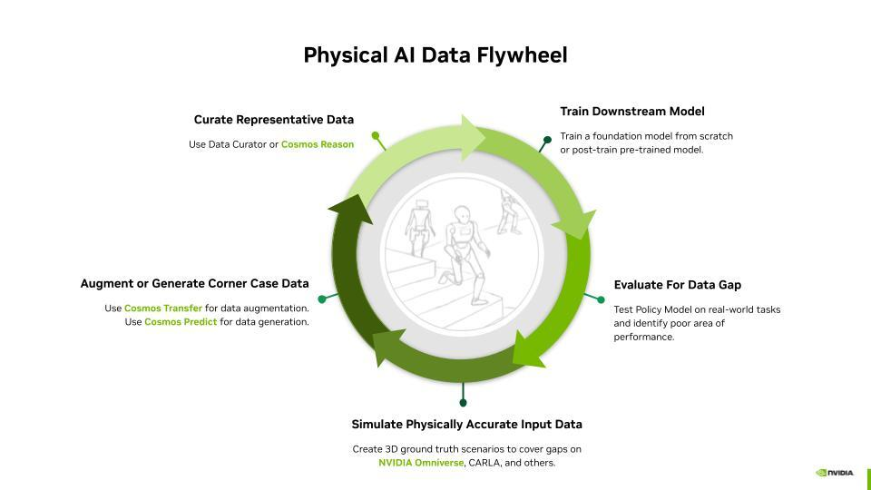

# NVIDIA Cosmos

Cosmos World Foundation Models come in three model types which can all be customized in post-training: [cosmos-predict](https://github.com/nvidia-cosmos/cosmos-predict1), [cosmos-transfer](https://github.com/nvidia-cosmos/cosmos-transfer1), and [cosmos-reason](https://github.com/nvidia-cosmos/cosmos-reason1):

|  | Predict | Transfer | Reason |
| ----- | :---: | :---: | :---: |
| **Type** | World Generation | Multi-Controlnet | Reasoning VLM |
| **Function** | Predict novel future frames given initial frames  | Transfer existing control frames into photoreal frames within a video clip | Reason against frames within a video clip |
| **Use Cases** | Data Generation & Policy Evaluation | Data Augmentation | Data Curation |
| **Inputs** | Text, Image, Video  | Multiple Video Modalities such as RGB, Depth, Segmentation, and more. | Video & Text |
| **Outputs** | Video | Video | Text  |

# 

# Use Cases in Physical AI Development

Our world foundation models are purpose-built to accelerate improving performance in downstream model tasks in various stages, as illustrated here in the flywheel.

